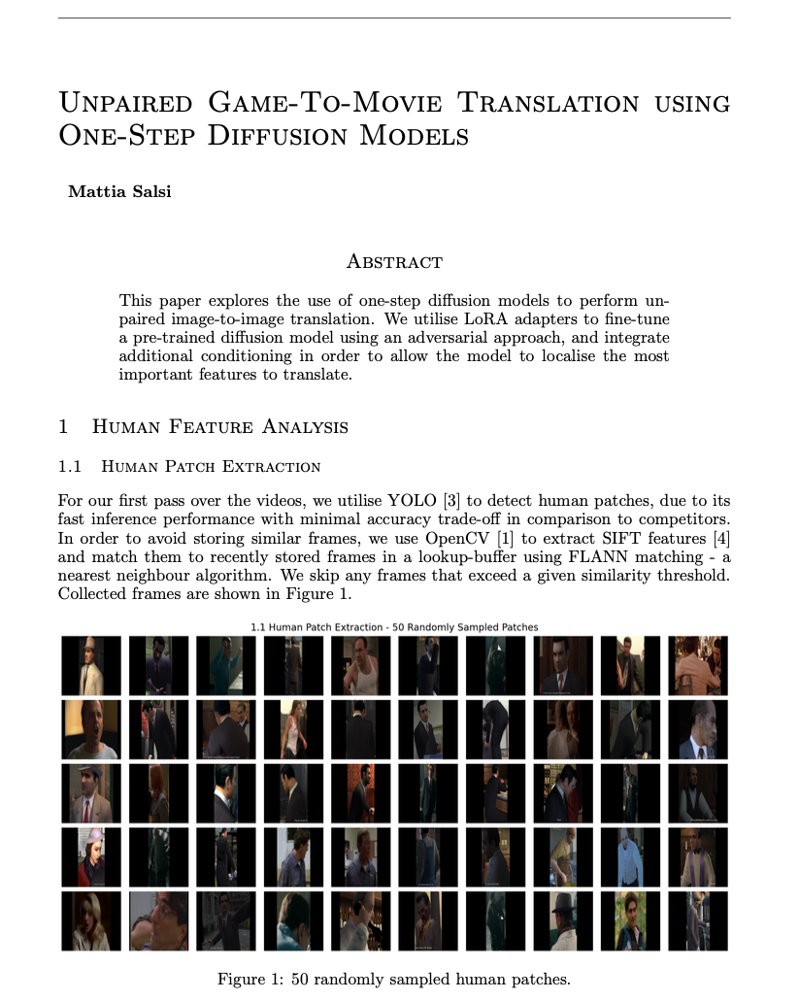

# Unpaired Game-To-Movie Translation using One-Step Diffusion Models

This was a coursework submission for the 4th year module Advanced Computer Vision. 

The task was to train a deep-learning model that could perform unpaired image-to-image translation, with the down-stream aim of using it to enhance the graphics of the old 'Mafia' videogame. 

## A summary of the appraoch

1. Dataset extraction
    - At the start, what we have are unlabelled videos of American gangster media (the Godfather, Sopranos) and the 'Mafia' videogame.
    - We scan over these videos with YOLO to detect and save human patches. Then, we use OpenCV to extract SIFT features and remove similar images using a lookup-buffer and FLANN matching.
    - We classify the human patches into various "poses" by extracting features uses MTCNN face-matching and YOLO pose estimation. These labels will be used to aid the training of our generator.
    - We perform some post-processing and dataset filtering 

2. Model training
    - We fine-tune Stability's SD-Turbo using LoRA to be able to perform game-to-movie (G2M) and movie-to-game (M2G) translation using one-step diffusion. To overcome the unlabelled datasets, we frame the training as a CycleGAN problem. Our model is conditioned on an image prior, a prompt indicating the direction (G2M/M2G), and the extracted face and POSE features.

3. Inference
    - Finally, we use the trained model on each frame of the 'Mafia' cut-scenes with the G2M prompt - framing the problem of graphics enhancement as a "translation" from a video-game to a real movie.

## Report

If you're interested in the full methodology and results, click [here](https://mattia-git.github.io/unpaired-game-to-movie-translation/) for full the report!

